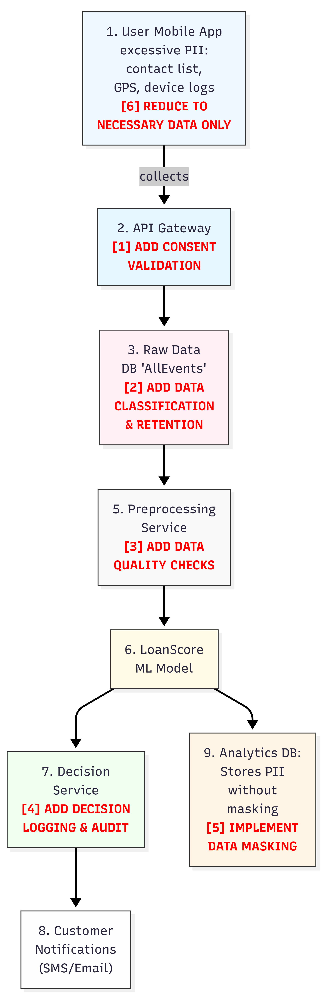

# QuickLoan Mobile Data Governance Review Report

## Executive Summary

This report documents findings from a data governance review of QuickLoan Mobile, a Ghana-based fintech startup offering instant micro-loans through a mobile application. The review identified critical risks in data quality, legal compliance, and algorithmic fairness within the company's automated loan-scoring pipeline. This document provides actionable recommendations to address these governance gaps.

---

## 1. Governance Review Card

| **Section** | **Issue/Definition** | **Impact** | **Suggested Fix/Mitigation** |
|-------------|---------------------|------------|------------------------------|
| **1. Data Quality Risk** | Customer data entering the preprocessing service contains incomplete records and inconsistent formatting (e.g., missing phone number prefixes, varied date formats, null income fields). This degrades the reliability of features fed into the ML model. | Incomplete or malformed data produces unreliable loan scores, leading to incorrect approval or rejection decisions. This increases default risk and customer complaints, and undermines trust in the automated system. | Implement automated data quality checks at the Preprocessing Service (Step 5). Enforce validation rules for required fields, standardize formats (phone numbers, dates, currency), and flag records below a completeness threshold for manual review before they reach the ML model. |
| **2. Legal & Compliance Risk** | The API Gateway (Step 2) transfers user data to the Raw Data DB without capturing explicit consent. Ghana's Data Protection Act (Act 843) requires informed, specific consent before processing personal data, particularly for automated decision-making that affects individuals' access to financial services. | QuickLoan operates in violation of Act 843, exposing the company to regulatory penalties, potential lawsuits, and reputational damage. Users have no documented agreement to the collection and use of their contact lists, GPS data, or device logs for loan decisions. | Insert a consent validation step between the API Gateway and Raw Data DB. Require users to review and accept a clear consent form detailing what data is collected, why it is necessary, and how it will be used. Log consent timestamps and versions in a separate compliance database. |
| **Data Classification** (Choose one: Public / Internal / Confidential / Sensitive) | The collected data includes contact lists, GPS location, device identifiers, and financial information. Under Act 843 and standard data protection frameworks, this qualifies as sensitive personal data. | Without proper classification, sensitive data receives inadequate protection controls, increasing breach risk and regulatory non-compliance. | **Classification Level: Sensitive** - Apply enhanced protection controls including encryption at rest and in transit, strict role-based access controls, audit logging for all access events, and data masking for non-production environments. |
| **3. Bias & Fairness Risk** | The ML model (Step 6) makes automated loan approval decisions without transparency logging or demographic fairness monitoring. If training data reflects historical lending biases (e.g., lower approval rates for certain regions, age groups, or genders), the model will replicate and automate those biases. | Certain demographic groups may face systematically lower approval rates, violating principles of fairness and potentially breaching anti-discrimination provisions in Ghana's legal framework. This creates legal liability and excludes creditworthy customers. | Add decision logging and audit trails at the Decision Service (Step 7). Record each loan decision with anonymized demographic metadata (region, age band, gender if available). Conduct quarterly fairness audits comparing approval rates across demographic segments. If disparities exceed a defined threshold (e.g., >10% difference in approval rates between groups with similar credit profiles), retrain the model with bias mitigation techniques. |
| **Source of Bias** | Historical loan approval patterns embedded in training data, combined with proxy variables (e.g., GPS location correlating with socioeconomic status, contact list size correlating with social networks) that indirectly encode protected characteristics such as ethnicity, gender, or regional origin. | The model learns and perpetuates historical discrimination patterns. Proxy variables allow the model to discriminate even without direct access to protected attributes, creating disparate impact on vulnerable populations. | Remove or carefully evaluate proxy variables during feature engineering. Implement fairness constraints during model training (e.g., demographic parity, equalized odds). Use adversarial debiasing techniques to prevent the model from learning protected attribute proxies. Establish a diverse model review committee to identify potential bias sources before deployment. |
| **4. Storytelling / Reporting Recommendation** | Implement a monthly fairness monitoring dashboard that tracks loan approval patterns across demographic segments to detect and address algorithmic bias before it causes harm. | Transparent reporting builds trust with customers, regulators, and investors. Early detection of bias prevents legal liability and reputational damage while ensuring equitable access to financial services. | Create an automated reporting pipeline that generates monthly fairness reports for compliance, product, and executive teams. Include trend analysis and automated alerts when fairness metrics fall below acceptable thresholds. |
| **Metric to Monitor (name & definition)** | **Demographic Approval Rate Parity (DARP)** - The ratio of loan approval rates between the lowest-approved demographic segment and the highest-approved segment, calculated monthly. A DARP of 1.0 indicates perfect parity; values below 0.85 trigger a fairness review. | Makes algorithmic fairness measurable and actionable, enabling QuickLoan to detect and address bias systematically rather than reactively. | Track DARP monthly alongside traditional business metrics (approval rate, default rate). When DARP falls below 0.85, automatically generate an investigation report requiring root cause analysis and corrective action plan within 14 days. |
| **Visualization Type** (e.g., Line Chart, Grouped Bar Chart) | **Grouped Bar Chart** showing monthly approval rates by demographic segment (e.g., region, age band), with a reference line at the overall approval rate. | Allows stakeholders to quickly identify segments receiving disproportionately low approval rates and track improvement over time. | Display on executive dashboard with drill-down capability to view segment-specific trends. Color-code segments: green (within 5% of average), yellow (5-15% below average), red (>15% below average, triggering immediate review). |
| **Why It Matters** (One sentence) | This metric operationalizes fairness by making bias visible and measurable, enabling QuickLoan to fulfill its legal obligations under Ghana's Data Protection Act while ensuring equitable access to financial services for all customer segments. | | |

---

## 2. Corrected Data Flow Diagram

The corrected diagram below addresses six critical flaws identified in the original pipeline. Each correction is annotated with a numbered reference explaining the change and its rationale.

### Diagram Corrections Verification

The submitted corrected diagram includes the following changes:

**[1] ADD CONSENT VALIDATION (API Gateway → Raw Data DB)**  
**Verified Correct**  
Implements explicit consent capture required by Ghana's Data Protection Act before storing personal data.

**[2] ADD DATA CLASSIFICATION & RETENTION (Raw Data DB)**  
**Verified Correct**  
Tags data by sensitivity level (Public/Internal/Confidential/Sensitive) and applies retention policies to comply with data minimization and storage limitation principles.

**[3] ADD DATA QUALITY CHECKS (Preprocessing Service)**  
**Verified Correct**  
Validates completeness, format consistency, and range constraints before data enters the ML model, preventing garbage-in-garbage-out failures.

**[4] ADD DECISION LOGGING & AUDIT (Decision Service)**  
**Verified Correct**  
Records each automated decision with metadata for transparency, enabling fairness audits and regulatory compliance (explainability requirements).

**[5] IMPLEMENT DATA MASKING (Analytics DB)**  
**Verified Correct**  
Pseudonymizes or anonymizes PII before storing in the Analytics DB to limit exposure risk and comply with purpose limitation (analytics does not require identifiable data).

**[6] REDUCE EXCESSIVE COLLECTION (User Mobile App)**  
**Verified Correct**  
The diagram correctly identifies "excessive PII: contact list, GPS, device logs" but should include a correction annotation showing:

- **Remove:** Contact list collection, continuous GPS tracking
- **Retain only:** Phone number (identity verification), coarse location/city-region (risk modeling), device ID (fraud detection)
- **Rationale:** Complies with data minimization principle (Act 843, Section 20). Contact lists and precise GPS coordinates are not necessary for creditworthiness assessment.

---

## 3. Review Methodology

The review applied data lifecycle and classification principles to trace QuickLoan's data from collection through storage, processing, and sharing. At each stage, the pipeline was assessed against requirements for lawful collection (consent), appropriate handling (classification and quality), transparent use (logging), and secure retention (masking, retention limits).

Data classification revealed that QuickLoan processes sensitive personal data, contact lists, location, financial status without applying corresponding safeguards. Mapping the lifecycle exposed gaps at critical transition points: no consent gate before storage, no quality validation before modeling, no transparency logging at decision time, and no anonymization before analytics. Each gap violates a core governance principle (lawfulness, accuracy, transparency, purpose limitation) and creates legal or operational risk.

The proposed Demographic Approval Rate Parity (DARP) metric operationalizes fairness monitoring by quantifying approval rate disparities across demographic segments. Tracking DARP monthly makes bias visible and actionable. The grouped bar chart visualization allows stakeholders to quickly identify segments receiving disproportionately low approval rates. If DARP falls below 0.85, the metric triggers a review protocol: investigate whether the disparity reflects legitimate credit risk differences or model bias, then apply corrective measures (retraining, feature adjustment, manual review for affected segments).

---

## 4. Recommendations Summary

### Immediate Actions (0-30 days)
- Implement consent validation at API Gateway
- Reduce data collection to necessary fields only
- Add data quality checks at Preprocessing Service

### Short-term Actions (1-3 months)
- Deploy data classification and retention policies
- Implement decision logging and audit trails
- Apply data masking in Analytics DB

### Ongoing Monitoring
- Track DARP metric monthly
- Conduct quarterly fairness audits
- Review and update consent forms as data practices evolve

---

## Appendices

### Appendix A: Ghana Data Protection Act (Act 843) Relevant Provisions
- Section 20: Data minimization and purpose limitation
- Section 23: Consent requirements for personal data processing
- Section 31: Automated decision-making and profiling safeguards

### Appendix B: Data Classification Schema
- **Public:** Non-sensitive, publicly available information
- **Internal:** Business data not for public disclosure
- **Confidential:** Proprietary business information requiring access controls
- **Sensitive:** Personal data requiring explicit consent and enhanced protection (PII, financial data, location, biometrics)

---

**Review Date:** 10th February, 2026  
**Reviewed By:** Eugene Anokye
